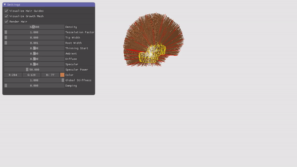
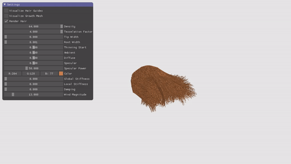

# hairgl
OpenGL implementation of realtime hair simulation and rendering.

Inspired by NVIDIA HairWorks and AMD TressFX.
Rendering multiple strands is implemented using tesselation and geometry shaders.
Simulation is implemented using compute shaders.
I used multiple articles and resources as references, but the most useful was this one:
[HairCourse](http://developer.download.nvidia.com/presentations/2010/SIGGRAPH/HairCourse_SIGGRAPH2010.pdf).

### How to export hairstyle from blender 
Use the script from 'util' folder. It works with blender 2.8. You should create an object, add a hair particle system, comb the hair and then just put the name of the object and the desired export path to the top of the script. 

Note: each mesh vertex should match with a hair root (just make sure that the number of hairs is equal to the number of vertices and hairs are emmited from vertices without random order).
